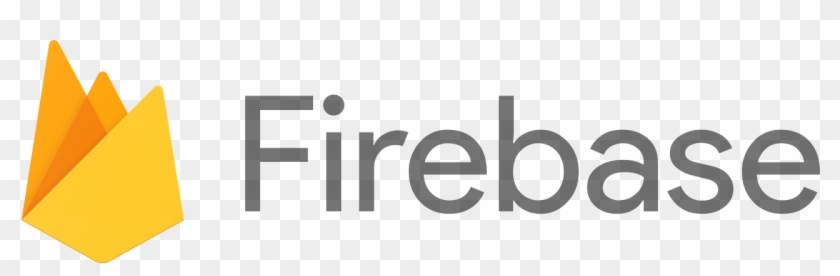

# Hello World 👋 !

## My name is William Benarto

I am an _programmer_ / _full-stack developer_ / _front-end engineer_ . I enjoy building things that live on the internet and aspire to help & create value for other people through my code. I am very much pleased to have you here on my GitHub page to show my contributions and projects. 

<a href="http://wbenarto.com/" target="_blank">website</a>

## Technologies:

### Frontend Technologies

  
  
  
  
  
  
  <!--  -->
  
  

 

### Backend Technologies

  
  
  
  
  
  

## What else do I do?

I love to cook for my friends and my family. My specialty is sushi and japanese food. Checkout my <a href="https://webesushi.io" target="_blank">sushi website</a>

I share the love of programming with my 11 year-old niece which I started tutoring in the beginning of 2020. We used Scratch programming to create projects and built her foundation in programming. She is now moving on to HTML and CSS to create her own website. 

I play basketball and a HUGE fan of the Golden State Warriors. 

I enjoy the outdoors, snowboarding, seafood harvesting around the bay, and photography.

  

  
---
<small> _I am a lifelong learner and I love teaching and inspiring people_. </small>